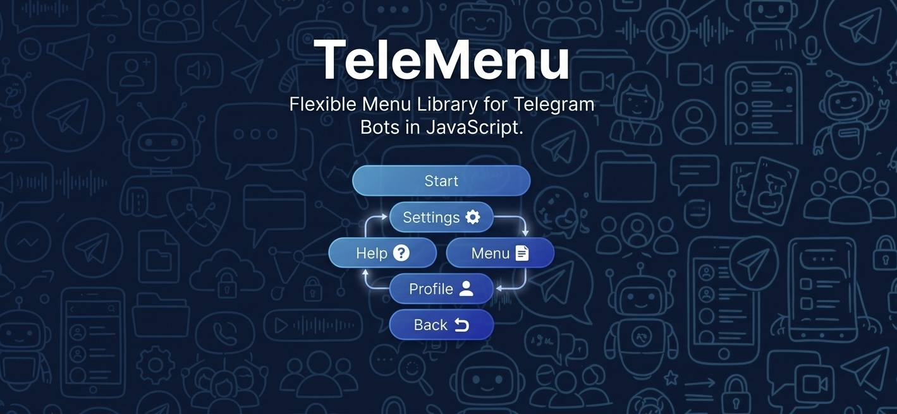

<p align="center">
  
</p>

# TeleMenu

TeleMenu simplifies creating interactive Telegram bot menus by providing an intuitive, chainable API for building inline keyboards, managing navigation, and handling callbacks. Built for [Telegraf](https://github.com/telegraf/telegraf) and compatible with other Telegram bot frameworks.

## Installation

**Requirements:**
- Node.js 18 or higher
- Telegraf 4.x (or compatible Telegram bot framework)

```bash
npm install telemenu
```

## Quick Start

```javascript
import { Telegraf } from 'telegraf';
import Menu from 'telemenu';

const bot = new Telegraf(process.env.BOT_TOKEN);

const mainMenu = new Menu('main');
const settingsMenu = new Menu('settings');

mainMenu
    .setCaption('Welcome! What would you like to do?')
    .text('Settings', (ctx, menu) => menu.nav('settings'))
    .text('Help', (ctx) => ctx.reply('Here\'s how to use this bot...'));

settingsMenu
    .setCaption('Settings')
    .text('Language', (ctx) => ctx.reply('Language: English'))
    .row()
    .text('Back', (ctx, menu) => menu.back());

mainMenu.register(settingsMenu);
bot.use(mainMenu);

bot.start(async (ctx) => {
    ctx.reply(mainMenu.getCaption(ctx), { reply_markup: await mainMenu.toJSON(ctx) });
});

bot.launch();
```

## API Reference

### Common Parameter Types

These types are used across multiple methods.

---

#### label

`string | (ctx, payload) => string`

Button text. Can be a static string or a function that receives the Telegraf context and current [payload](#payload), and returns text.

```javascript
// Static
menu.text('Click me', handler);

// Dynamic with context
menu.text((ctx) => `Hello ${ctx.from.first_name}`, handler);

// Dynamic with payload
menu.text((ctx, payload) => `User: ${payload.name}`, handler);
```

---

#### options

`Rule | ButtonConfig`

Optional configuration passed as the last argument to button methods. Can be:
- A [Rule](#rule) instance
- An [Options Object](#options-object) with rule, style, icon

```javascript
// Rule instance
menu.text('Admin', handler, adminRule);

// Options object
menu.text('Admin', handler, {
    rule: adminRule,
    style: 'danger',
    icon: '6030563507299160824'
});
```

##### Options Object Structure

```javascript
{
    rule?: Rule | {
        when?: (ctx) => boolean,        // Condition predicate
        lock?: boolean,                  // Block action when fails
        hide?: boolean,                  // Hide when fails
        failStyle?: 'primary' | 'success' | 'danger',  // Style when fails
        failIcon?: string,               // Emoji ID when fails
        failLabel?: string,              // Custom label when fails
        onFail?: (ctx, menuApi) => void  // Handler when fails
    },
    style?: 'primary' | 'success' | 'danger',  // Button style
    icon?: string  // Telegram custom emoji ID (numeric string)
}
```

---

#### handler

`(ctx, menuApi) => any`

Function called when a button is clicked. Receives:
- `ctx` — Telegraf context
- `menuApi` — [MenuApi](#menuapi) for navigation, updates, and accessing [payload](#payload)

```javascript
menu.text('Click', (ctx, menuApi) => {
    ctx.reply('Clicked!');
    menuApi.update();
});

// Access payload
menu.text('View User', (ctx, menuApi) => {
    const payload = menuApi.getPayload();
    ctx.reply(`User: ${payload.userId}`);
});
```

---

#### payload

`any`

Data passed between menus during navigation. Can be any value (string, number, object, array).

```javascript
// Send with payload
menu.nav('user_detail', { userId: 123 });

// Receive in target menu
menu.setCaption((ctx, payload) => `User: ${payload.userId}`);
```

### Menu

```javascript
import Menu from 'telemenu';

const menu = new Menu('unique_id');
```

Creates a new menu with a unique identifier. The menu instance can be used directly as Telegraf middleware via `bot.use(menu)`.

---

### setCaption

```javascript
// Static text
menu.setCaption('Choose an option:');

// Dynamic text with context
menu.setCaption((ctx, payload) => {
    return `Hello ${ctx.from.first_name}!`;
});

// With parse mode
menu.setCaption('*Bold text*', 'MarkdownV2');
```

| Parameter | Type | Description |
|-----------|------|-------------|
| `caption` | `string \| (ctx, payload) => string` | Message text. Can be a string or a function. |
| `format` | `'Markdown' \| 'MarkdownV2' \| 'HTML'` | Parse mode. Default: `'Markdown'`. |

**Returns:** `this` (for chaining)

---

### text

```javascript
// Simple
menu.text('Click me', (ctx) => ctx.reply('Clicked!'));

// Dynamic label
menu.text((ctx) => `Hello ${ctx.from.first_name}`, handler);

// With options
menu.text('Admin Only', handler, {
    rule: adminRule,
    style: 'danger',
    icon: '6030563507299160824'
});

// With Rule directly
menu.text('Premium', handler, premiumRule);
```

| Parameter | Type | Description |
|-----------|------|-------------|
| `label` | [label](#label) | Button text |
| `handler` | [handler](#handler) | Click handler |
| `options` | [options](#options) | Optional. Rule or options object |

**Returns:** `this` (for chaining)

---

### url

```javascript
menu.url('Visit GitHub', 'https://github.com');
menu.url('Docs', 'https://docs.example.com', { style: 'primary' });
```

| Parameter | Type | Description |
|-----------|------|-------------|
| `label` | [label](#label) | Button text |
| `url` | `string` | URL to open when clicked |
| `options` | [options](#options) | Optional. Rule or options object |

**Returns:** `this` (for chaining)

---

### webApp

```javascript
menu.webApp('Open App', 'https://myapp.example.com');
```

| Parameter | Type | Description |
|-----------|------|-------------|
| `label` | [label](#label) | Button text |
| `webAppUrl` | `string` | Telegram Web App URL |
| `options` | [options](#options) | Optional. Rule or options object |

**Returns:** `this` (for chaining)

---

### copy

```javascript
menu.copy('Copy Code', 'ABC-123-XYZ');
```

| Parameter | Type | Description |
|-----------|------|-------------|
| `label` | [label](#label) | Button text |
| `copyText` | `string` | Text copied to clipboard |
| `options` | [options](#options) | Optional. Rule or options object |

**Returns:** `this` (for chaining)

---

### submenu

```javascript
menu.submenu('Settings', 'settings');
menu.submenu('View User', 'user_detail', userId);
menu.submenu('View User', 'user_detail', (ctx) => ctx.from.id);
```

| Parameter | Type | Description |
|-----------|------|-------------|
| `label` | [label](#label) | Button text |
| `submenuId` | `string` | Target menu ID |
| `payload` | [payload](#payload) | Optional. Data to pass to submenu |
| `options` | [options](#options) | Optional. Rule or options object |

**Returns:** `this` (for chaining)

---

### back

```javascript
menu.back('← Back');
menu.back('← Back', 'main_menu');
menu.back('← Back', null, (ctx) => ({ userId: ctx.from.id }));
```

| Parameter | Type | Description |
|-----------|------|-------------|
| `label` | [label](#label) | Button text |
| `menuId` | `string` | Optional. Target menu. Default: parent menu |
| `payload` | [payload](#payload) | Optional. Data to pass |
| `options` | [options](#options) | Optional. Rule or options object |

**Returns:** `this` (for chaining)

---

### row

```javascript
menu
    .text('Button 1', handler)
    .text('Button 2', handler) // Same row
    .row()                      // New row
    .text('Button 3', handler); // Next row
```

**Returns:** `this` (for chaining)

---

### dynamic

```javascript
menu.dynamic(async (ctx, range, payload) => {
    const items = await fetchItems();
    for (const item of items) {
        range
            .text(item.name, (ctx) => ctx.reply(`Selected: ${item.name}`))
            .row();
    }
});
```

| Parameter | Type | Description |
|-----------|------|-------------|
| `generator` | `(ctx, range, [payload](#payload)) => any \| Promise<any>` | Function that generates buttons. `range` is a [MenuRange](#menurange). |

**Returns:** `this` (for chaining)

---

### register

```javascript
mainMenu.register(settingsMenu);
mainMenu.register(profileMenu);
```

| Parameter | Type | Description |
|-----------|------|-------------|
| `submenu` | `Menu` | Menu to register as child |

**Returns:** `this` (for chaining)

---

### nav

```javascript
menu.text('Go to Settings', (ctx, menuApi) => {
    menuApi.nav('settings');
    menuApi.nav('user_detail', { userId: 123 });
});
```

| Parameter | Type | Description |
|-----------|------|-------------|
| `menuId` | `string` | Target menu ID |
| `payload` | [payload](#payload) | Optional. Data to pass |

**Returns:** `Promise<boolean>`

---

### sendToChat

```javascript
bot.command('menu', async (ctx) => {
    await menu.sendToChat(ctx);
});

await menu.sendToChat(ctx, { section: 'settings' });
```

| Parameter | Type | Description |
|-----------|------|-------------|
| `ctx` | `any` | Telegraf context (needs `ctx.telegram` and `ctx.chat.id`) |
| `payload` | [payload](#payload) | Optional. Data for dynamic captions |

**Returns:** `Promise<Object>` — Sent message info from Telegram API

---

#### MenuApi

Provided as the second argument in [handler](#handler). Used for navigation and menu updates.

```javascript
menu.text('Button', (ctx, menuApi) => {
    menuApi.nav('target_menu');
    menuApi.back();
    menuApi.update();
    const data = menuApi.getPayload();
});
```

| Method | Parameters | Description |
|--------|------------|-------------|
| `nav(menuId, payload?)` | `menuId: string`, `payload?: [payload](#payload)` | Navigate to another menu |
| `back(menuId?, payload?)` | `menuId?: string`, `payload?: [payload](#payload)` | Go back to parent or specific menu |
| `update()` | — | Refresh the current menu inline |
| `getPayload()` | — | Get the current [payload](#payload) |

---

### Rule

```javascript
import { rule } from 'telemenu';

const premiumRule = rule((ctx) => ctx.from.is_premium)
    .lock()
    .failLabel('⭐ Premium Required')
    .failStyle('danger')
    .failIcon('6030563507299160824')
    .onFail((ctx) => ctx.reply('Access denied'));
```

| Method | Parameters | Description |
|--------|------------|-------------|
| `rule(predicate)` | `(ctx) => boolean \| Promise<boolean>` | Create a rule with a condition |
| `.lock()` | — | Block action when rule fails |
| `.hide()` | — | Hide button when rule fails |
| `.failStyle(style)` | `'danger' \| 'success' \| 'primary'` | Style when rule fails |
| `.failIcon(id)` | `string` | Custom emoji when rule fails (numeric Telegram emoji ID) |
| `.failLabel(text)` | `string` | Custom label when rule fails |
| `.onFail(handler)` | [handler](#handler) | Run when rule fails |

---

#### MenuRange

Used inside [dynamic](#dynamic) generators. Provides the same button methods as [Menu](#menu):

| Method | Same as |
|--------|---------|
| `text(label, handler?, options?)` | [Menu.text()](#text) |
| `url(label, url, options?)` | [Menu.url()](#url) |
| `webApp(label, webAppUrl, options?)` | [Menu.webApp()](#webapp) |
| `copy(label, copyText, options?)` | [Menu.copy()](#copy) |
| `submenu(label, submenuId, payload?, options?)` | [Menu.submenu()](#submenu) |
| `row()` | [Menu.row()](#row) |

```javascript
menu.dynamic(async (ctx, range, payload) => {
    const users = await fetchUsers();
    for (const user of users) {
        range
            .text(user.name, (ctx) => ctx.reply(`Selected: ${user.name}`))
            .row();
    }
});
```

## Examples

See the [`examples/`](./examples) directory:

- [`simple-menu.js`](./examples/simple-menu.js) — Basic multi-level menu
- [`advanced-navigation.js`](./examples/advanced-navigation.js) — Payload-based navigation
- [`dynamic-content.js`](./examples/dynamic-content.js) — Dynamic buttons with rules
- [`rules-and-conditions.js`](./examples/rules-and-conditions.js) — Rule API with failStyle, failIcon, lock, hide
- [`options-object.js`](./examples/options-object.js) — Options object pattern
- [`practical-use-cases.js`](./examples/practical-use-cases.js) — Real-world: e-commerce, admin, settings

```bash
# Run an example
BOT_TOKEN=your_token node examples/simple-menu.js
```

## Contributing

Contributions are welcome! Please open an issue or pull request on [GitHub](https://github.com/Nimawr/TeleMenu).

## License

MIT © [TeleMenu Contributors](https://github.com/Nimawr/TeleMenu/blob/main/LICENSE)
